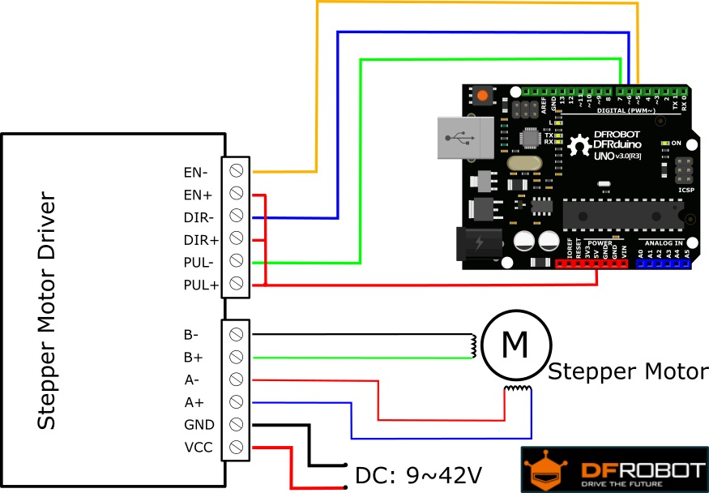

# Cách điều khiển động cơ DC Motor
- Để hiểu rõ sâu hơn về điều khiển động cơ mọi người có thể tham khảo bài giảng của Thầy Chương [1]
<br> </br>
## Yêu cầu phần cứng:
- [Mạch nạp STM32](https://hshop.vn/products/mach-nap-st-link-v2)
- [STM32F103C8T6](https://hshop.vn/products/kit-ra-chon-stm32f103c8t6)
- [Driver Điều Khiển Động Cơ Bước](https://hshop.vn/products/mach-dieu-khien-dong-co-buoc-microstep-4a-40vdc)
- Nguồn tổ ông 12V
- [Động cơ bước step](https://www.banggood.com/42mm-12V-Nema-17-Two-Phase-Stepper-Motor-For-3D-Printer-p-1975637.html?utm_source=googleshopping&utm_medium=cpc_organic&gmcCountry=VN&utm_content=minha&utm_campaign=aceng-pmax-vn-vi-pc&currency=VND&cur_warehouse=CN&createTmp=1&utm_source=googleshopping&utm_medium=cpc_us&utm_campaign=aceng-pmax-as-vn-all-220402-massa&utm_content=massa&ad_id=&gclid=Cj0KCQjww4-hBhCtARIsAC9gR3ZtFyS1T1cHediUpmBthDK560uCHjf3EJRKOXVJRGaUpfI0w-ooPMQaAhgREALw_wcB)


## Setup STM32F103C8T6
- `SYS` -> `Serial Wire`
- Cấu hình chân đọc encoder: `PA4`-> `GPIO_Output`| `PA5` -> `GPIO_Output`
- 
## Bản kết nối phần cứng:
**Ghi chú**:
- Điều khiển động cơ cần sử dụng hai chân để điều khiển vị trí và hướng quay của động cơ, là chân "step" và chân "dir".
   - Chân "step": Chân này được sử dụng để điều khiển số lần xung đưa vào động cơ bước. Mỗi xung điện sẽ tương ứng với một bước di chuyển của động cơ. Bằng cách điều chỉnh số lần xung, ta có thể điều khiển động cơ bước di chuyển theo một khoảng cách xác định.

  - Chân "dir": Chân này được sử dụng để điều khiển hướng quay của động cơ bước. Nếu ta muốn động cơ quay theo chiều thuận, chân này sẽ được kết nối với đầu vào Logic High, còn nếu muốn động cơ quay ngược chiều, chân này sẽ được kết nối với đầu vào Logic Low.


| GPIO | Chức năng |
|------|-----------|
| PA4  |    Dir    |
| PA5  |    Step   |

#### Thứ tự nối chân
- Theo trên ảnh, có thể bỏ 2 chân `EN+` và `EN-` của Driver
- Còn `Dir-` -> `PA4`; `Pul-` -> `PA5`

## Code [[Tham khảo tại đây](../STEP_MOTOR)]:
- Đầu tiên kích chân `DIR` để nó đảo chiều
- Kích 1-0-1-0 để động cơ step quay
- Delay càng ngắn động cơ quay càng nhanh
```
  /* USER CODE BEGIN WHILE */
  while (1)
  {
  	 HAL_GPIO_WritePin(DIR_GPIO_Port, DIR_Pin, 1);

		HAL_GPIO_WritePin(STEP_GPIO_Port, STEP_Pin, 1);
		HAL_Delay(1);
		HAL_GPIO_WritePin(STEP_GPIO_Port, STEP_Pin, 0);
		HAL_Delay(1);
    /* USER CODE END WHILE */
```

- Để nó quay số vòng mình muốn có thể bỏ vào vòng lặp `for` với `n` là vị trí mình muốn nó dừng quay:
```
for(int x = 0; x < n; x++) {
	HAL_GPIO_WritePin(STEP_GPIO_Port, STEP_Pin, 1);
	HAL_Delay(1);
	HAL_GPIO_WritePin(STEP_GPIO_Port, STEP_Pin, 0);
	HAL_Delay(1);
}
```


## Tài liệu tham khảo:
- [1] [Điều khiển động cơ Thầy Võ Lâm Chương](https://www.youtube.com/watch?v=VUqa3zvIrp8&list=PLpC3GniHRC0NSpHS_Y8AzRGS1mAb4zcHJ&ab_channel=Ph%E1%BA%A1mMinhTu%E1%BA%A5n)
